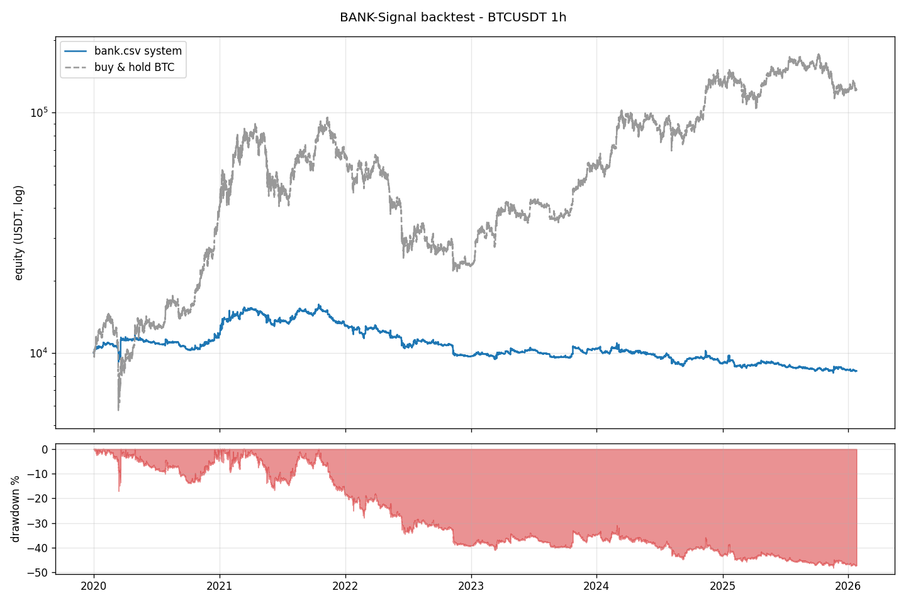

# BANK-Signal backtest report

* period: `2020-01-01 00:00:00` -> `2026-01-24 18:00:00` (53147 1h bars)
* equity: `10,000` -> `8,399.55` USDT

## Headline

| metric | value |
| --- | ---: |
| total return | -16.00% |
| buy & hold | 1,145.82% |
| CAGR | -2.83% |
| max drawdown | -48.26% |
| Sharpe | -0.07 |
| Sortino | -0.07 |
| Calmar | -0.06 |
| trades | 2473 (2473 long / 0 short) |
| win rate | 44.64% |
| profit factor | 1.03 |
| expectancy / trade | -0.193% |
| avg win / avg loss | 1.28% / -1.38% |
| avg holding time | 13.0 bars |
| time in market | 60.4% |

## Yearly returns

| year | return |
| --- | ---: |
| 2020 | 19.19% |
| 2021 | 8.49% |
| 2022 | -25.14% |
| 2023 | 7.38% |
| 2024 | -13.04% |
| 2025 | -6.20% |
| 2026 | -0.92% |

## Best entry rules (by realised PnL)

| rule | trades | win rate | total pnl | avg return |
| --- | ---: | ---: | ---: | ---: |
| PYRAMID_LEVEL2 | 244 | 78.3% | 25,625.91 | 1.02% |
| TRAIL_DELTA | 132 | 87.9% | 23,448.98 | 1.55% |
| TRAIL_ENERGY | 131 | 84.0% | 21,933.49 | 1.46% |
| SCALE_OUT_30 | 145 | 79.3% | 18,688.96 | 1.19% |
| SCALE_OUT_20 | 89 | 89.9% | 17,730.87 | 1.63% |
| SCALE_OUT_10 | 105 | 83.8% | 17,633.34 | 1.42% |
| TRAIL_WAVE | 82 | 89.0% | 17,423.62 | 1.91% |
| PYRAMID_LEVEL3 | 77 | 90.9% | 12,984.31 | 1.84% |
| DEFENSE_03 | 34 | 97.1% | 8,538.26 | 1.94% |
| HIGHER_HIGH_CONTINUE | 210 | 52.4% | 4,659.59 | 0.15% |
| SCALE_OUT_50 | 12 | 91.7% | 4,242.57 | 2.90% |
| MOMENTUM_END | 117 | 47.9% | 3,788.57 | 0.02% |
| HIDDEN_EXHAUSTION | 204 | 45.6% | 3,217.84 | -0.09% |
| EARLY_EXHAUSTION_BUY | 280 | 50.7% | 2,875.07 | -0.01% |
| BEAR_STRUCTURE | 349 | 50.7% | 2,871.58 | 0.04% |

## Exit reasons

| reason | count |
| --- | ---: |
| SIGNAL_EXIT | 1414 |
| STOP_LOSS | 794 |
| TRAIL_ENERGY | 732 |
|  SCALE_OUT_10 | 653 |
| DEFENSE_03 | 476 |
|  SCALE_OUT_20 | 403 |
| SCALE_OUT_10 | 307 |
|  TRAIL_DELTA | 161 |
|  DEFENSE_03 | 144 |
|  PYRAMID_LEVEL2 | 139 |

