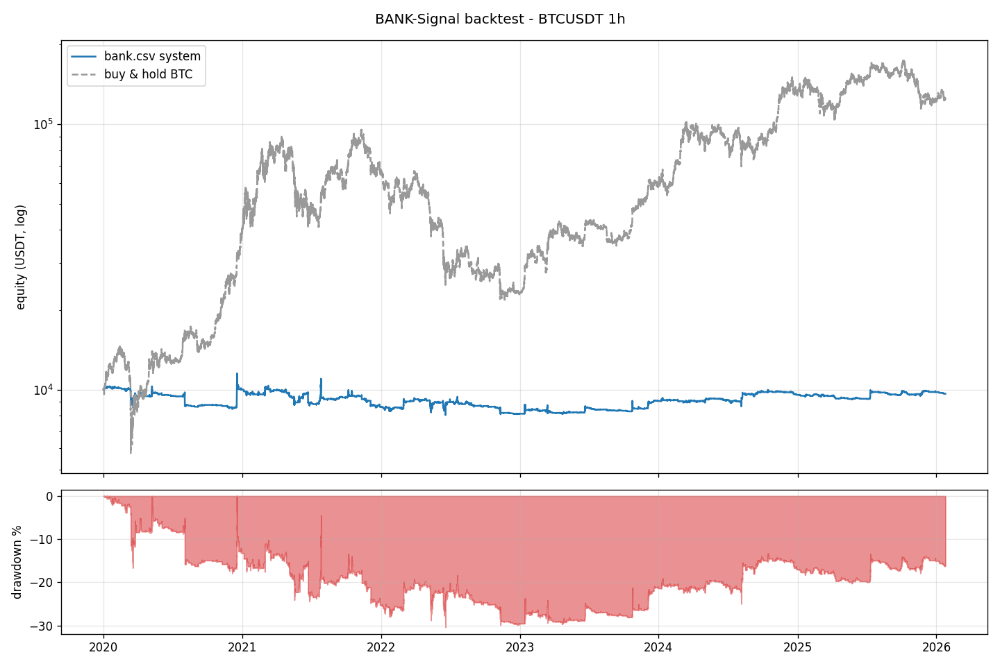

# BANK-Signal backtest report

* period: `2020-01-01 00:00:00` -> `2026-01-24 18:00:00` (53147 1h bars)
* equity: `10,000` -> `9,645.63` USDT

## Headline

| metric | value |
| --- | ---: |
| total return | -3.54% |
| buy & hold | 1,145.82% |
| CAGR | -0.59% |
| max drawdown | -30.37% |
| Sharpe | 0.06 |
| Sortino | 0.03 |
| Calmar | -0.02 |
| trades | 613 (613 long / 0 short) |
| win rate | 43.72% |
| profit factor | 1.03 |
| expectancy / trade | -0.404% |
| avg win / avg loss | 1.41% / -1.81% |
| avg holding time | 25.3 bars |
| time in market | 29.2% |

## Yearly returns

| year | return |
| --- | ---: |
| 2020 | -0.07% |
| 2021 | -13.96% |
| 2022 | -5.65% |
| 2023 | 11.61% |
| 2024 | 5.53% |
| 2025 | 2.38% |
| 2026 | -1.39% |

## Best entry rules (by realised PnL)

| rule | trades | win rate | total pnl | avg return |
| --- | ---: | ---: | ---: | ---: |
| PYRAMID_LEVEL2 | 135 | 65.2% | 7,362.56 | 0.34% |
| PYRAMID_LEVEL3 | 37 | 83.8% | 6,164.50 | 1.01% |
| SUPPORT_MAJOR | 124 | 50.8% | 1,916.26 | -0.23% |
| CASCADE_03 | 182 | 42.3% | 1,729.70 | -0.33% |
| ENERGY_RECOVER | 357 | 42.3% | 1,306.36 | -0.43% |
| FIVE_CONFIRMATION | 163 | 40.5% | 1,182.60 | -0.36% |
| WAVE_ACCELERATION | 57 | 50.9% | 1,124.05 | 0.14% |
| MOMENTUM_START | 513 | 43.1% | 711.56 | -0.40% |
| TREND_Q1 | 366 | 45.6% | 466.20 | -0.43% |
| EARLY_WAVE_LONG | 570 | 43.9% | 442.70 | -0.41% |
| CONFLUENCE_03 | 46 | 52.2% | 369.79 | 0.00% |
| CONFLUENCE_02 | 54 | 51.9% | 359.40 | -0.01% |
| CASCADE_08 | 119 | 41.2% | 304.70 | -0.40% |
| CASCADE_05 | 125 | 41.6% | 237.97 | -0.41% |
| PRESSURE_EXHAUSTION | 20 | 60.0% | 211.39 | 0.28% |

## Exit reasons

| reason | count |
| --- | ---: |
| SIGNAL_EXIT | 400 |
| STOP_LOSS | 264 |
| PYRAMID_LEVEL2 | 32 |
|  PYRAMID_LEVEL3 | 4 |
| PYRAMID_LEVEL3 | 2 |

